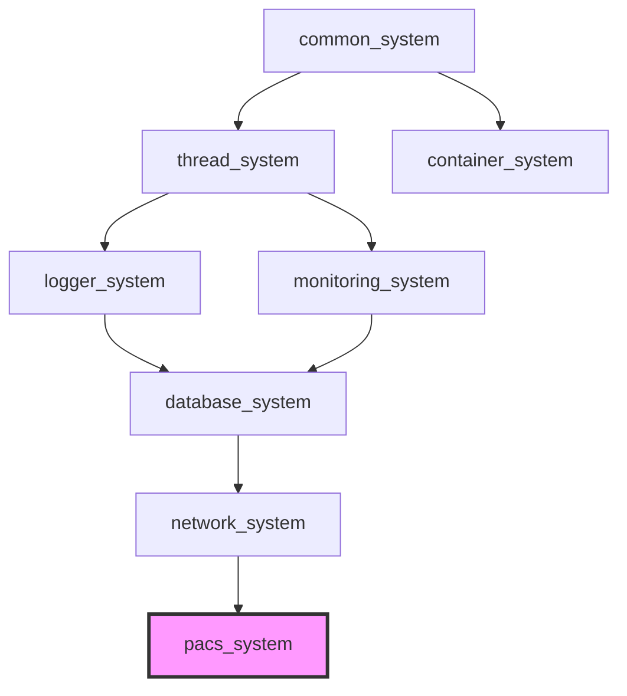

[](https://github.com/kcenon/pacs_system/actions/workflows/ci.yml)
[](https://github.com/kcenon/pacs_system/actions/workflows/integration-tests.yml)
[](https://github.com/kcenon/pacs_system/actions/workflows/coverage.yml)
[](https://github.com/kcenon/pacs_system/actions/workflows/static-analysis.yml)
[](https://codecov.io/gh/kcenon/pacs_system)
[](https://github.com/kcenon/pacs_system/actions/workflows/build-Doxygen.yaml)
[](https://github.com/kcenon/pacs_system/actions/workflows/sbom.yml)
[](https://github.com/kcenon/pacs_system/blob/main/LICENSE)

# PACS System

> **언어:** [English](README.md) | **한국어**

## 개요

외부 DICOM 라이브러리 없이 kcenon 에코시스템을 기반으로 구축된 현대적인 C++20 PACS(Picture Archiving and Communication System) 구현체입니다. 이 프로젝트는 기존의 고성능 인프라를 활용하여 DICOM 표준을 처음부터 구현합니다.

**핵심 특징**:
- **외부 DICOM 라이브러리 제로**: kcenon 에코시스템을 활용한 순수 구현
- **고성능**: SIMD 가속, lock-free 큐, 비동기 I/O 활용
- **프로덕션 품질**: 종합적인 CI/CD, 새니타이저, 품질 메트릭
- **모듈식 아키텍처**: 인터페이스 기반 설계로 관심사의 명확한 분리
- **크로스 플랫폼**: Linux, macOS, Windows 지원

---

## 목차

- [프로젝트 상태](#프로젝트-상태)
- [아키텍처](#아키텍처)
- [DICOM 적합성](#dicom-적합성)
- [vcpkg 기능](#vcpkg-기능)
- [시작하기](#시작하기)
- [CLI 도구 및 예제](#cli-도구-및-예제)
- [에코시스템 의존성](#에코시스템-의존성)
- [프로젝트 구조](#프로젝트-구조)
- [C++20 모듈 지원](#c20-모듈-지원)
- [문서](#문서)
- [성능](#성능)
- [코드 통계](#코드-통계)
- [규정 준수](#규정-준수)
- [기여하기](#기여하기)
- [라이선스](#라이선스)
- [연락처](#연락처)

---

## 프로젝트 상태

**현재 버전**: 1.0.0 — 안정 공개 API
**프로젝트 단계**: Phase 4 완료 — 고급 서비스 및 프로덕션 강화

v1.0 계약은 `include/kcenon/pacs/` 아래의 공개 헤더 표면, `pacs_system::pacs_system`
집계 CMake 타겟, 그리고 문서화된 Doxygen API를 고정합니다. 고정된 헤더 목록은
[`docs/v1.0-api-surface.md`](docs/v1.0-api-surface.md)를, 예외/Result<T> 계약은
[`docs/v1.0-throw-policy.md`](docs/v1.0-throw-policy.md)를, 고정 이전 지원 중단 감사는
[`docs/v1.0-deprecation-inventory.md`](docs/v1.0-deprecation-inventory.md)를 참조하세요.

0.x에서 업그레이드하시나요? 전체 업그레이드 절차(include 경로, 네임스페이스, CMake 계약,
`Result<T>` 마이그레이션, 디렉터리 재배치)는 [0.x → 1.0 마이그레이션 가이드](docs/migration/0.x-to-1.0.md)에서
시작하세요. 그리고 `samples/` → `examples/` 및 `examples/` → `tools/` 디렉터리 재배치(#1139)와
`pacs_system::pacs_system` CMake 계약(#1158)을 포함한 기반 변경 사항은 [CHANGELOG](CHANGELOG.md)를 확인하세요.

| 단계 | 범위 | 상태 |
|-------|-------|--------|
| **Phase 1**: 기반 | DICOM 코어, 태그 사전, 파일 I/O (Part 10), 전송 구문 | 완료 |
| **Phase 2**: 네트워크 프로토콜 | Upper Layer Protocol (PDU), Association 상태 머신, DIMSE-C, 압축 코덱 | 완료 |
| **Phase 3**: 핵심 서비스 | Storage SCP/SCU, 파일 스토리지, 인덱스 데이터베이스, Query/Retrieve, 로깅, 모니터링 | 완료 |
| **Phase 4**: 고급 서비스 | REST API, DICOMweb, AI 통합, 클라이언트 모듈, 클라우드 스토리지, 인쇄 관리, 보안, 워크플로우, 주석/뷰어 | 완료 |

**테스트 커버리지**: 141+ 테스트 파일에서 1,980+ 테스트 통과 | [](https://codecov.io/gh/kcenon/pacs_system)

> 단계별 상세 기능 목록은 [Features](docs/FEATURES.md)를 참조하세요.

---

## 아키텍처

```
┌──────────────────────────────────────────────────────────────────────┐
│                            PACS System                               │
├──────────────────────────────────────────────────────────────────────┤
│  ┌──────────┐ ┌──────────┐ ┌─────────┐ ┌──────────┐ ┌───────────┐  │
│  │ REST API │ │ DICOMweb │ │ Web UI  │ │ AI Svc   │ │ Workflow  │  │
│  │ (Crow)   │ │ WADO/STOW│ │ (React) │ │Connector │ │ Scheduler │  │
│  └────┬─────┘ └────┬─────┘ └────┬────┘ └────┬─────┘ └─────┬─────┘  │
│       └─────────────┼───────────┼───────────┼──────────────┘        │
│  ┌──────────────────▼───────────▼───────────▼────────────────────┐  │
│  │  IHE Actors (XDS.b Source / Consumer / Registry Query + ATNA) │  │
│  └──────────────────────────────┬────────────────────────────────┘  │
│  ┌──────────────────────────────▼────────────────────────────────┐  │
│  │  Services (Storage/Query/Retrieve/Worklist/MPPS/Commit/Print) │  │
│  └──────────────────────────────┬────────────────────────────────┘  │
│  ┌──────────────────────────────▼────────────────────────────────┐  │
│  │  Network (PDU/Association/DIMSE) + Security (RBAC/TLS/Anon)   │  │
│  └──────────────────────────────┬────────────────────────────────┘  │
│  ┌──────────────────────────────▼────────────────────────────────┐  │
│  │  Core (Tag/Element/Dataset/File) + Encoding (VR/Codecs/SIMD)  │  │
│  └──────────────────────────────┬────────────────────────────────┘  │
│  ┌─────────────┐  ┌─────────────┴──────────┐  ┌─────────────────┐  │
│  │  Storage    │  │  Client Module         │  │  Monitoring     │  │
│  │  (DB/File/  │  │  (Job/Route/Sync/      │  │  (Health/       │  │
│  │   S3/Azure) │  │   Prefetch/RemoteNode) │  │   Metrics)      │  │
│  └──────┬──────┘  └────────────────────────┘  └─────────────────┘  │
├─────────┼────────────────────────────────────────────────────────────┤
│         │             Integration Adapters + DI                      │
│  container │ network │ thread │ logger │ monitoring                  │
├─────────┼────────────────────────────────────────────────────────────┤
│         │              kcenon Ecosystem                               │
│  common_system │ container_system │ thread_system │ network_system   │
│  logger_system │ monitoring_system │ database_system (opt)           │
└──────────────────────────────────────────────────────────────────────┘
```

---

## DICOM 적합성

### 지원 SOP 클래스

| 서비스 | SOP 클래스 | 상태 |
|---------|-----------|--------|
| **Verification** | 1.2.840.10008.1.1 | ✅ 완료 |
| **CT Storage** | 1.2.840.10008.5.1.4.1.1.2 | ✅ 완료 |
| **MR Storage** | 1.2.840.10008.5.1.4.1.1.4 | ✅ 완료 |
| **US Storage** | 1.2.840.10008.5.1.4.1.1.6.x | ✅ 완료 |
| **XA Storage** | 1.2.840.10008.5.1.4.1.1.12.x | ✅ 완료 |
| **XRF Storage** | 1.2.840.10008.5.1.4.1.1.12.2 | ✅ 완료 |
| **X-Ray Storage** | 1.2.840.10008.5.1.4.1.1.1.1 | ✅ 완료 |
| **Patient Root Q/R** | 1.2.840.10008.5.1.4.1.2.1.x | ✅ 완료 |
| **Study Root Q/R** | 1.2.840.10008.5.1.4.1.2.2.x | ✅ 완료 |
| **Modality Worklist** | 1.2.840.10008.5.1.4.31 | ✅ 완료 |
| **MPPS** | 1.2.840.10008.3.1.2.3.3 | ✅ 완료 |
| **Storage Commitment** | 1.2.840.10008.1.20.1 | ✅ 완료 |
| **NM Storage** | 1.2.840.10008.5.1.4.1.1.20 | ✅ 완료 |
| **PET Storage** | 1.2.840.10008.5.1.4.1.1.128 | ✅ 완료 |
| **RT Storage** | 1.2.840.10008.5.1.4.1.1.481.x | ✅ 완료 |
| **SR Storage** | 1.2.840.10008.5.1.4.1.1.88.x | ✅ 완료 |
| **SEG Storage** | 1.2.840.10008.5.1.4.1.1.66.4 | ✅ 완료 |
| **MG Storage** | 1.2.840.10008.5.1.4.1.1.1.2.x | ✅ 완료 |
| **CR Storage** | 1.2.840.10008.5.1.4.1.1.1 | ✅ 완료 |
| **SC Storage** | 1.2.840.10008.5.1.4.1.1.7 | ✅ 완료 |
| **Basic Grayscale Print** | 1.2.840.10008.5.1.1.9 | ✅ 완료 |
| **Basic Color Print** | 1.2.840.10008.5.1.1.18 | ✅ 완료 |
| **Printer** | 1.2.840.10008.5.1.1.16 | ✅ 완료 |

### 전송 구문 지원

| 전송 구문 | UID | 상태 |
|----------------|-----|--------|
| Implicit VR Little Endian | 1.2.840.10008.1.2 | ✅ 완료 |
| Explicit VR Little Endian | 1.2.840.10008.1.2.1 | ✅ 완료 |
| Explicit VR Big Endian | 1.2.840.10008.1.2.2 | ✅ 완료 |
| JPEG Baseline (Process 1) | 1.2.840.10008.1.2.4.50 | ✅ 완료 |
| JPEG Lossless (Process 14) | 1.2.840.10008.1.2.4.70 | ✅ 완료 |
| JPEG 2000 Lossless | 1.2.840.10008.1.2.4.90 | ✅ 완료 |
| JPEG 2000 Lossy | 1.2.840.10008.1.2.4.91 | ✅ 완료 |
| JPEG-LS Lossless | 1.2.840.10008.1.2.4.80 | ✅ 완료 |
| JPEG-LS Near-Lossless | 1.2.840.10008.1.2.4.81 | ✅ 완료 |
| RLE Lossless | 1.2.840.10008.1.2.5 | ✅ 완료 |

> 전체 DICOM 적합성 선언문은 [DICOM Conformance Statement](docs/DICOM_CONFORMANCE_STATEMENT.md)를 참조하세요.

---

## vcpkg 기능

```bash
vcpkg install kcenon-pacs-system[feature1,feature2,...]
```

| 기능 | 기본값 | 설명 | 추가 의존성 | 사전 요구사항 |
|---------|:-------:|-------------|----------|---------------|
| aws | off | 클라우드 기반 PACS 스토리지를 위한 AWS S3 통합 | aws-sdk-cpp (S3) | -- |
| azure | off | 클라우드 기반 PACS 스토리지를 위한 Azure Blob 스토리지 통합 | azure-storage-blobs-cpp | -- |
| codecs | off | 이미지 압축 코덱 (JPEG, JPEG 2000, HTJ2K, JPEG-LS, PNG) | libjpeg-turbo, openjpeg, charls, openjph, libpng | -- |
| rest-api | off | Crow HTTP 프레임워크를 통한 DICOMweb REST API | crow | -- |
| ssl | off | 보안 DICOM association을 위한 TLS/SSL 지원 | openssl | -- |
| storage | off | SQLite3 기반 PACS 스토리지 및 인덱싱 | sqlite3 | -- |
| testing | off | 단위 테스트 및 벤치마크 | benchmark | -- |

### 기능 선택 가이드

- **최소 설치**: `vcpkg install kcenon-pacs-system`
- **TLS를 포함한 프로덕션**: `vcpkg install kcenon-pacs-system[storage,ssl]`
- **전체 영상 파이프라인**: `vcpkg install kcenon-pacs-system[storage,codecs,ssl,rest-api]`
- **클라우드 배포 (AWS)**: `vcpkg install kcenon-pacs-system[storage,codecs,ssl,aws,rest-api]`

---

## 시작하기

### 사전 요구사항

**모든 플랫폼:**
- Concepts를 지원하는 C++20 호환 컴파일러:
  - GCC 10+ (완전한 std::format 지원을 위해 GCC 13+ 권장)
  - Clang 10+ (Clang 14+ 권장)
  - MSVC 2022 (19.30+)
- CMake 3.20+
- Ninja (권장 빌드 시스템)
- kcenon 에코시스템 라이브러리 (CMake가 자동 다운로드)

**Linux (Ubuntu 24.04+):**
```bash
sudo apt install cmake ninja-build libsqlite3-dev libssl-dev libfmt-dev
```

**macOS:**
```bash
brew install cmake ninja sqlite3 openssl@3 fmt
```

**Windows:**
- C++ 워크로드를 포함한 Visual Studio 2022
- 패키지 관리를 위한 [vcpkg](https://vcpkg.io/)
- 의존성: `sqlite3`, `openssl`, `fmt`

### 빌드

#### Linux/macOS

```bash
# 리포지토리 클론
git clone https://github.com/kcenon/pacs_system.git
cd pacs_system

# 구성 및 빌드
cmake -S . -B build
cmake --build build

# 테스트 실행
cd build && ctest --output-on-failure
```

#### Windows

```powershell
# 사전 요구사항: Visual Studio 2022, vcpkg, CMake 3.20+

# vcpkg를 통한 의존성 설치
vcpkg install sqlite3:x64-windows openssl:x64-windows fmt:x64-windows

# 리포지토리 클론
git clone https://github.com/kcenon/pacs_system.git
cd pacs_system

# vcpkg 툴체인으로 구성
cmake -S . -B build -G Ninja `
  -DCMAKE_TOOLCHAIN_FILE="$env:VCPKG_ROOT/scripts/buildsystems/vcpkg.cmake"

# 빌드
cmake --build build

# 테스트 실행
cd build
ctest --output-on-failure
```

**테스트 결과**: 141+ 테스트 파일에서 1,980+ 테스트 통과 (Core, Encoding, Network, Services, Storage, Security, Web, Workflow, Client, AI, Monitoring, Integration)

### 테스트 프레임워크

`pacs_system`은 단위 테스트 코퍼스에 kcenon 에코시스템 기본값인 **GoogleTest**와는 다른 **Catch2 v3.4.0**을 사용합니다. 기존 테스트 코퍼스는 Catch2 관용구(`TEST_CASE`, `SECTION`)에 의존하며, 디렉터리 구조 표준화 작업에서 마이그레이션은 의도적으로 범위 밖입니다. 전체 근거와 추적 이슈 [#1141](https://github.com/kcenon/pacs_system/issues/1141)은 [`docs/ECOSYSTEM.md`](docs/ECOSYSTEM.md#per-system-conventions)("Per-system conventions" 섹션)를 참조하세요.

### 빌드 옵션

```cmake
PACS_BUILD_TESTS (ON)              # 단위 테스트 활성화
PACS_BUILD_EXAMPLES (OFF)          # 예제 빌드 활성화
PACS_BUILD_BENCHMARKS (OFF)        # 벤치마크 활성화
PACS_BUILD_STORAGE (ON)            # 스토리지 모듈 빌드
```

### vcpkg를 통한 설치

```bash
vcpkg install kcenon-pacs-system
```

### CMake 통합

pacs_system을 설치(`cmake --install`, vcpkg 또는 기타 패키지 관리자를 통해)한 후,
다운스트림 프로젝트는 정규 CMake 타겟 `pacs_system::pacs_system`을 통해 의존합니다:

```cmake
find_package(pacs_system 1.0 REQUIRED)

add_executable(my_app main.cpp)
target_link_libraries(my_app PRIVATE pacs_system::pacs_system)
```

`pacs_system::pacs_system`은 필수 및 빌드된 모든 선택적 하위 컴포넌트를 끌어오는 집계
INTERFACE 타겟이므로, 일반적인 소비자에게는 단일 `target_link_libraries` 호출로 충분합니다.

세밀한 제어가 필요하면 개별 컴포넌트를 링크하세요. 사용 가능한 컴포넌트 타겟은 다음과 같습니다:

| 컴포넌트 | 타겟 | 제공 기능 |
|-----------|--------|----------|
| Core | `pacs_system::core` | 태그, 데이터셋, Part 10 파일 I/O |
| Encoding | `pacs_system::encoding` | VR 타입, 전송 구문, 코덱 |
| Network | `pacs_system::network` | PDU, association, DIMSE |
| Client | `pacs_system::client` | 작업/라우팅/동기/프리페치 관리자 |
| Services | `pacs_system::services` | SCP/SCU 구현 |
| Security | `pacs_system::security` | RBAC, 익명화, 서명, TLS |
| Storage | `pacs_system::storage` | 파일 스토리지, SQLite, S3/Azure (선택) |
| AI | `pacs_system::ai` | AI 서비스 커넥터 (선택) |
| Monitoring | `pacs_system::monitoring` | 헬스 체크, 메트릭 (선택) |
| Workflow | `pacs_system::workflow` | 자동 프리페치, 스케줄링 (선택) |
| Web | `pacs_system::web` | REST API, DICOMweb (선택) |
| Integration | `pacs_system::integration` | 에코시스템 어댑터 (선택) |

레거시 표기 `kcenon::pacs_system`은 하위 호환성을 위한 별칭으로 유지되지만, 새 코드는
`pacs_system::pacs_system`을 사용해야 합니다.

### Windows 개발 참고사항

Windows 호환 코드를 작성할 때는 Windows.h 매크로와의 충돌을 방지하기 위해 `std::min`과
`std::max` 호출을 괄호로 감싸세요:

```cpp
// 올바름: 모든 플랫폼에서 동작
size_t result = (std::min)(a, b);
auto value = (std::max)(x, y);

// 잘못됨: Windows MSVC에서 실패 (error C2589)
size_t result = std::min(a, b);
auto value = std::max(x, y);
```

---

## CLI 도구 및 예제

이 프로젝트는 두 개의 상호 보완적인 하위 트리를 제공합니다(자세한 내용은 [#1139](https://github.com/kcenon/pacs_system/issues/1139) 참조):

- `tools/` — 32개의 독립 실행형 CLI 유틸리티 바이너리
- `examples/` — 5개의 점진적 튜토리얼 (`01_hello_dicom`부터 `05_production_pacs`까지)

CLI 도구 빌드:

```bash
cmake -S . -B build -DPACS_BUILD_EXAMPLES=ON
cmake --build build
```

튜토리얼 빌드:

```bash
cmake -S . -B build -DPACS_BUILD_SAMPLES=ON
cmake --build build
```

> CMake 옵션 이름(`PACS_BUILD_EXAMPLES`, `PACS_BUILD_SAMPLES`)은 기존 CI 및 다운스트림
> 소비자와의 하위 호환성을 위해 유지됩니다.

### 도구 요약

| 카테고리 | 도구 | 설명 |
|----------|------|-------------|
| **파일 유틸리티** | `dcm_dump` | DICOM 파일 메타데이터 검사 |
| | `dcm_info` | DICOM 파일 요약 표시 |
| | `dcm_modify` | DICOM 태그 수정 (dcmtk 호환) |
| | `dcm_conv` | 전송 구문 변환 |
| | `dcm_anonymize` | DICOM 파일 비식별화 (PS3.15) |
| | `dcm_dir` | DICOMDIR 생성/관리 (PS3.10) |
| | `dcm_to_json` | DICOM을 JSON으로 변환 (PS3.18) |
| | `json_to_dcm` | JSON을 DICOM으로 변환 (PS3.18) |
| | `dcm_to_xml` | DICOM을 XML로 변환 (PS3.19) |
| | `xml_to_dcm` | XML을 DICOM으로 변환 (PS3.19) |
| | `img_to_dcm` | JPEG 이미지를 DICOM으로 변환 |
| | `dcm_extract` | 픽셀 데이터를 이미지 형식으로 추출 |
| | `db_browser` | PACS 인덱스 데이터베이스 탐색 |
| **네트워크** | `echo_scu` / `echo_scp` | DICOM 연결 검증 |
| | `secure_dicom` | TLS 보안 DICOM Echo SCU/SCP |
| | `store_scu` / `store_scp` | DICOM 스토리지 (C-STORE) |
| | `query_scu` | 쿼리 클라이언트 (C-FIND) |
| | `find_scu` | dcmtk 호환 C-FIND SCU |
| | `retrieve_scu` | 검색 클라이언트 (C-MOVE/C-GET) |
| | `move_scu` | dcmtk 호환 C-MOVE SCU |
| | `get_scu` | dcmtk 호환 C-GET SCU |
| | `print_scu` | 인쇄 관리 클라이언트 (PS3.4 Annex H) |
| **서버** | `qr_scp` | Query/Retrieve SCP (C-FIND/C-MOVE/C-GET) |
| | `worklist_scu` / `worklist_scp` | Modality Worklist (MWL) |
| | `mpps_scu` / `mpps_scp` | Modality Performed Procedure Step |
| | `pacs_server` | 구성 기능을 갖춘 전체 PACS 서버 |
| **테스팅** | `integration_tests` | 엔드 투 엔드 워크플로우 테스트 |

### 빠른 예제

**DICOM 연결 검증:**
```bash
./build/bin/echo_scu localhost 11112
```

**DICOM 파일 전송:**
```bash
./build/bin/store_scu localhost 11112 image.dcm
```

**환자 이름으로 연구 조회:**
```bash
./build/bin/query_scu localhost 11112 PACS_SCP --level STUDY --patient-name "DOE^*"
```

**DICOM 파일 검사:**
```bash
./build/bin/dcm_dump image.dcm --format json
```

> 모든 옵션을 포함한 전체 CLI 문서는 [CLI Reference](docs/CLI_REFERENCE.md)를 참조하세요.

---

## 에코시스템 의존성

### 에코시스템 의존성 맵



> **에코시스템 참조**:
> [common_system](https://github.com/kcenon/common_system) — Tier 0: Result&lt;T&gt;, IExecutor, 이벤트 버스
> [container_system](https://github.com/kcenon/container_system) — Tier 1: DICOM 데이터 직렬화
> [thread_system](https://github.com/kcenon/thread_system) — Tier 1: 스레드 풀 (network_system 경유)
> [logger_system](https://github.com/kcenon/logger_system) — Tier 2: 로깅 인프라 (network_system 경유)
> [monitoring_system](https://github.com/kcenon/monitoring_system) — Tier 3: 메트릭 및 관찰 가능성 (선택)
> [network_system](https://github.com/kcenon/network_system) — Tier 4: DICOM용 TCP/TLS 전송
> [database_system](https://github.com/kcenon/database_system) — Tier 3: 데이터베이스 추상화 (선택)

> 버전, 라이선스, 안전 분류를 포함한 전체 IEC 62304 SOUP 등록부는 [docs/SOUP.md](docs/SOUP.md)를 참조하세요.

이 프로젝트는 다음 kcenon 에코시스템 컴포넌트를 활용합니다:

| 시스템 | 목적 | 주요 기능 |
|--------|---------|--------------|
| **common_system** | 기반 인터페이스 | IExecutor, Result<T>, 이벤트 버스 |
| **container_system** | 데이터 직렬화 | 타입 안전 값, SIMD 가속 |
| **thread_system** | 동시성 | 스레드 풀, lock-free 큐 |
| **logger_system** | 로깅 | 비동기 로깅, 4.34M msg/s |
| **monitoring_system** | 관찰 가능성 | 메트릭, 분산 추적 |
| **network_system** | 네트워크 I/O | TCP/TLS, 비동기 작업 |
| **database_system** | 데이터베이스 추상화 | SQL 인젝션 방지, 다중 DB 지원 (선택) |

---

## 프로젝트 구조

공개 헤더는 `include/kcenon/pacs/<module>/` 아래에 위치합니다. 레거시 `include/pacs/...`
경로는 폐기되었으며, 모든 소비자는 `#include <kcenon/pacs/...>`를 사용해야 합니다.

| 모듈 | 위치 | 설명 |
|--------|----------|-------------|
| **Core** | `include/kcenon/pacs/core/` | DICOM 태그, 요소, 데이터셋, Part 10 파일 I/O, 태그 사전 |
| **Encoding** | `include/kcenon/pacs/encoding/` | VR 타입, 전송 구문, 압축 코덱 (JPEG, JP2K, JPLS, RLE) |
| **Network** | `include/kcenon/pacs/network/` | PDU 인코딩/디코딩, association 상태 머신, DIMSE 프로토콜 |
| **Services** | `include/kcenon/pacs/services/` | SCP/SCU 구현, SOP 클래스 레지스트리, IOD 검증기 |
| **Storage** | `include/kcenon/pacs/storage/` | 파일 스토리지, SQLite 인덱싱, 클라우드 스토리지 (S3/Azure), HSM |
| **Security** | `include/kcenon/pacs/security/` | RBAC, 익명화 (PS3.15), 디지털 서명, TLS |
| **Monitoring** | `include/kcenon/pacs/monitoring/` | 헬스 체크, Prometheus 메트릭 |
| **Web** | `include/kcenon/pacs/web/` | REST API (Crow), DICOMweb (WADO/STOW/QIDO) |
| **Client** | `include/kcenon/pacs/client/` | 작업, 라우팅, 동기, 프리페치, 원격 노드 관리 |
| **Workflow** | `include/kcenon/pacs/workflow/` | 자동 프리페치, 작업 스케줄러, 연구 잠금 관리자 |
| **AI** | `include/kcenon/pacs/ai/` | AI 서비스 커넥터, 결과 처리기 (SR/SEG) |
| **Integration** | `include/kcenon/pacs/integration/` | 에코시스템 어댑터 (container, network, thread, logger, monitoring) |
| **IHE** | `include/kcenon/pacs/ihe/` | IHE 액터 (XDS.b Document Source/Consumer, Registry Query, ATNA 감사) |
| **DI** | `include/kcenon/pacs/di/` | 서비스 구성을 위한 의존성 주입 유틸리티 |
| **Compat** | `include/kcenon/pacs/compat/` | 크로스 플랫폼 및 레거시 include 경로용 호환성 shim |

```
pacs_system/
├── include/kcenon/pacs/  # 공개 헤더 (290 파일)
├── src/                  # 소스 구현 (217 파일)
├── tests/                # 테스트 스위트 (189 파일, 2,657+ 테스트)
├── examples/             # 튜토리얼 (5단계 점진적 학습)
├── tools/                # CLI 유틸리티 바이너리 (32 앱)
├── docs/                 # 문서 (87 마크다운 파일)
└── CMakeLists.txt        # 빌드 구성 (v1.0.0)
```

> 전체 파일 수준 디렉터리 트리는 [Project Structure](docs/PROJECT_STRUCTURE.md)를 참조하세요.

---

## C++20 모듈 지원

PACS System은 헤더 기반 인터페이스의 대안으로 C++20 모듈 지원을 제공합니다.

### 모듈 요구사항

- **CMake 3.28+**
- **Clang 16+, GCC 14+ 또는 MSVC 2022 17.4+**
- 모듈을 지원하는 **common_system**, **container_system**, **network_system**

### 모듈로 빌드하기

```bash
cmake -B build -DPACS_BUILD_MODULES=ON
cmake --build build
```

### 모듈 사용하기

```cpp
import kcenon.pacs;

int main() {
    // PACS 컴포넌트를 직접 사용
    auto server = kcenon::pacs::create_scp_server();
    server->start();
}
```

### 모듈 구조

| 모듈 | 내용 |
|--------|----------|
| `kcenon.pacs` | 기본 모듈 (모든 파티션 임포트) |
| `kcenon.pacs:core` | 핵심 DICOM 데이터 구조 및 유틸리티 |
| `kcenon.pacs:network` | DICOM 네트워크 프로토콜 (DIMSE) |
| `kcenon.pacs:storage` | DICOM 파일 스토리지 및 검색 |
| `kcenon.pacs:encoding` | 전송 구문 및 코덱 지원 |
| `kcenon.pacs:services` | DICOM 서비스 구현 (C-STORE, C-FIND 등) |
| `kcenon.pacs:security` | TLS 및 인증 |
| `kcenon.pacs:web` | DICOMweb REST API |
| `kcenon.pacs:workflow` | 워크플로우 관리 |

> **참고**: C++20 모듈은 실험적입니다. 헤더 기반 인터페이스가 기본 API로 유지됩니다.

## 문서

- 🌐 [API Reference (Doxygen)](https://kcenon.github.io/pacs_system/) — 호스팅된 Doxygen 출력 (`include/kcenon/pacs/**`에서 생성)
- 📋 [Implementation Analysis](docs/PACS_IMPLEMENTATION_ANALYSIS.md) - 상세 구현 전략
- 📋 [Product Requirements](docs/PRD.md) - 제품 요구사항 문서
- 🏗️ [Architecture Guide](docs/ARCHITECTURE.md) - 시스템 아키텍처
- ⚡ [Features](docs/FEATURES.md) - 기능 명세
- 📁 [Project Structure](docs/PROJECT_STRUCTURE.md) - 디렉터리 구조
- 🔧 [API Reference (narrative)](docs/API_REFERENCE.md) - 상위 수준 API 설명
- 🖥️ [CLI Reference](docs/CLI_REFERENCE.md) - CLI 도구 문서
- 📄 [DICOM Conformance Statement](docs/DICOM_CONFORMANCE_STATEMENT.md) - DICOM 적합성
- 🏥 [IHE Integration Statement](docs/IHE_INTEGRATION_STATEMENT.md) - IHE 프로파일 적합성 (XDS-I.b, AIRA, PIR)
- 🚀 [Migration Complete](docs/MIGRATION_COMPLETE.md) - 스레드 시스템 마이그레이션 요약

**업그레이드:**
- 📘 [0.x to 1.0 Migration Guide](docs/migration/0.x-to-1.0.md) - 0.1.0 베이스라인과 1.0.0 API 고정 사이의 모든 호환성 변경 사항, 전후 스니펫, `Result<T>` 마이그레이션 설명, 자가 점검 체크리스트 포함.

**데이터베이스 통합:**
- 🗄️ [Migration Guide](docs/database/MIGRATION_GUIDE.md) - database_system 통합 가이드
- 📚 [API Reference (Database)](docs/database/API_REFERENCE.md) - Query Builder API 문서
- 🏛️ [ADR-001](docs/adr/ADR-001-database-system-integration.md) - 아키텍처 결정 기록
- 🏛️ [ADR-002](docs/adr/ADR-002-pacs-storage-port-segmentation.md) - PACS 스토리지 경계 및 리포지토리 세트 계약
- ⚡ [Performance Guide](docs/database/PERFORMANCE_GUIDE.md) - 데이터베이스 최적화 팁
- 📦 [Dependency Manifest](dependency-manifest.json) - 정규 네이티브, 페치, 내부, 프런트엔드 출처
- ⚖️ [Third-Party Licenses](LICENSE-THIRD-PARTY) - 제품 배포 라이선스 목록

---

## 성능

PACS 시스템은 고성능 동시 작업을 위해 `thread_system` 라이브러리를 활용합니다.
스레드 시스템 마이그레이션(Epic #153)이 성공적으로 완료되어, 모든 직접 `std::thread` 사용이
jthread 지원 및 취소 토큰을 포함한 현대적인 C++20 추상화로 대체되었습니다.
상세 벤치마크 결과는 [PERFORMANCE_RESULTS.md](docs/PERFORMANCE_RESULTS.md)를, 마이그레이션 요약은
[MIGRATION_COMPLETE.md](docs/MIGRATION_COMPLETE.md)를 참조하세요.

### 주요 성능 메트릭

| 메트릭 | 결과 |
|--------|--------|
| **Association 지연 시간** | < 1 ms |
| **C-ECHO 처리량** | 89,964 msg/s |
| **C-STORE 처리량** | 31,759 store/s |
| **동시 작업** | 124 ops/s (10 워커) |
| **정상 종료** | 110 ms (활성 연결 포함) |
| **데이터 전송률 (512x512)** | 9,247 MB/s |

### 벤치마크 실행

```bash
# 벤치마크와 함께 빌드
cmake -B build -DPACS_BUILD_BENCHMARKS=ON
cmake --build build

# 모든 벤치마크 실행
cmake --build build --target run_full_benchmarks

# 특정 벤치마크 카테고리 실행
./build/bin/thread_performance_benchmarks "[benchmark][association]"
./build/bin/thread_performance_benchmarks "[benchmark][throughput]"
./build/bin/thread_performance_benchmarks "[benchmark][concurrent]"
./build/bin/thread_performance_benchmarks "[benchmark][shutdown]"
```

---

## 코드 통계

<!-- STATS_START -->

| 메트릭 | 값 |
|--------|-------|
| **헤더 파일** | 290 파일 |
| **소스 파일** | 217 파일 |
| **헤더 LOC** | ~78700 라인 |
| **소스 LOC** | ~114700 라인 |
| **예제 LOC** | ~4100 라인 |
| **테스트 LOC** | ~89100 라인 |
| **전체 LOC** | ~286500 라인 |
| **테스트 파일** | 189 파일 |
| **테스트 케이스** | 2657+ 테스트 |
| **예제 프로그램** | 6 앱 |
| **문서** | 87 마크다운 파일 |
| **CI/CD 워크플로우** | 15 워크플로우 |
| **버전** | 1.0.0 |
| **최종 업데이트** | 2026-05-13 |

<!-- STATS_END -->

---

## 규정 준수

`pacs_system`은 의료 기관이 정보보안관리체계(ISMS)의 일부로 사용할 수 있는 기술적 기본 요소를
제공합니다. 라이브러리 자체는 인증되지 않았으며, 도입 기관이 이를 통합하고 조직적 통제(정책,
교육, 사고 대응, 업무 연속성 계획)를 제공합니다.

- [ISO 27799 통제 매핑](docs/compliance/iso-27799.md) — ATNA 감사 추적, 감사 로그 암호화, TLS 정책, 접근 통제, 익명화가 ISO 27799:2016 조항 7.4–7.7에 어떻게 매핑되는지
- [DICOM Conformance Statement](docs/DICOM_CONFORMANCE_STATEMENT.md) — 구현된 ISO 12052 / DICOM 2023e 서비스, SOP 클래스, 전송 구문

에코시스템 수준의 색인 [common_system / ISO Standards Overview](https://github.com/kcenon/common_system/blob/develop/docs/compliance/ISO_OVERVIEW.md)는 kcenon 시스템이 다루는 모든 ISO 표준을 나열합니다.

---

## 기여하기

기여를 환영합니다! Pull Request를 제출하기 전에 기여 가이드라인을 읽어 주세요.

---

## 라이선스

이 프로젝트는 BSD 3-Clause 라이선스에 따라 배포됩니다 - 자세한 내용은 [LICENSE](LICENSE) 파일을 참조하세요.

---

## 연락처

- **프로젝트 소유자**: kcenon (kcenon@naver.com)
- **리포지토리**: https://github.com/kcenon/pacs_system
- **이슈**: https://github.com/kcenon/pacs_system/issues

---

<p align="center">
  Made with ❤️ by 🍀☀🌕🌥 🌊
</p>
