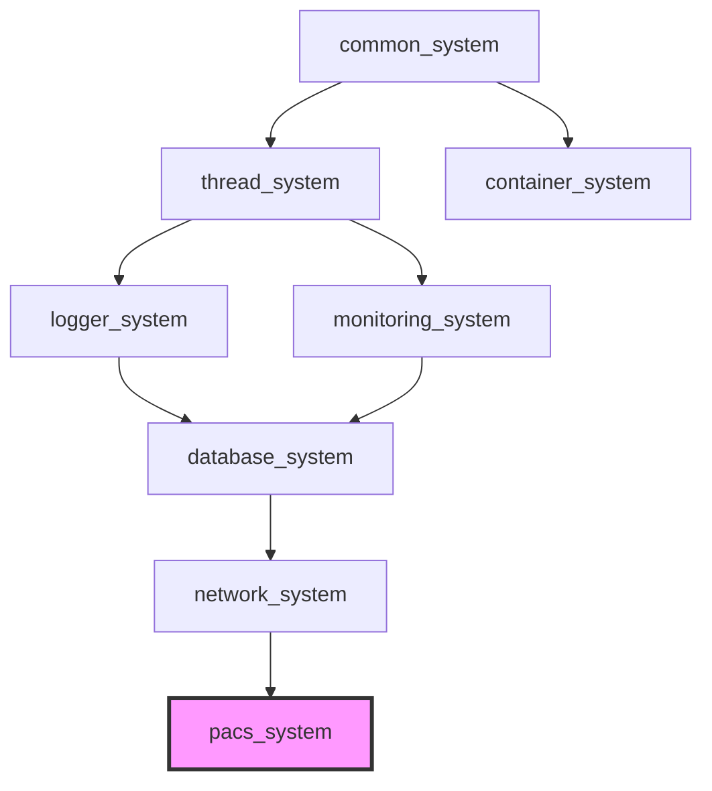

[](https://github.com/kcenon/pacs_system/actions/workflows/ci.yml)
[](https://github.com/kcenon/pacs_system/actions/workflows/integration-tests.yml)
[](https://github.com/kcenon/pacs_system/actions/workflows/coverage.yml)
[](https://github.com/kcenon/pacs_system/actions/workflows/static-analysis.yml)
[](https://codecov.io/gh/kcenon/pacs_system)
[](https://github.com/kcenon/pacs_system/actions/workflows/build-Doxygen.yaml)
[](https://github.com/kcenon/pacs_system/actions/workflows/sbom.yml)
[](https://github.com/kcenon/pacs_system/blob/main/LICENSE)

# PACS System

> **Language:** **English** | [한국어](README.kr.md)

## Overview

A modern C++20 PACS (Picture Archiving and Communication System) implementation built entirely on the kcenon ecosystem without external DICOM libraries. This project implements the DICOM standard from scratch, leveraging the existing high-performance infrastructure.

**Key Characteristics**:
- **Zero External DICOM Libraries**: Pure implementation using kcenon ecosystem
- **High Performance**: Leveraging SIMD acceleration, lock-free queues, and async I/O
- **Production Grade**: Comprehensive CI/CD, sanitizers, and quality metrics
- **Modular Architecture**: Clean separation of concerns with interface-driven design
- **Cross-Platform**: Linux, macOS, Windows support

---

## Table of Contents

- [Project Status](#project-status)
- [Architecture](#architecture)
- [DICOM Conformance](#dicom-conformance)
- [vcpkg Features](#vcpkg-features)
- [Getting Started](#getting-started)
- [CLI Tools & Examples](#cli-tools--examples)
- [Ecosystem Dependencies](#ecosystem-dependencies)
- [Project Structure](#project-structure)
- [Documentation](#documentation)
- [Performance](#performance)
- [Code Statistics](#code-statistics)
- [Compliance](#compliance)
- [Contributing](#contributing)
- [License](#license)
- [Contact](#contact)

---

## Project Status

**Current Version**: 1.0.0-rc — release candidate, not yet tagged (v1.0.0 tag pending #1095)
**Project Phase**: Phase 4 Complete — Advanced Services & Production Hardening

The v1.0 contract freezes the public header surface under `include/kcenon/pacs/`, the
`pacs_system::pacs_system` aggregate CMake target, and the documented Doxygen API. See
[`docs/v1.0-api-surface.md`](docs/v1.0-api-surface.md) for the frozen header inventory,
[`docs/v1.0-throw-policy.md`](docs/v1.0-throw-policy.md) for the exception/Result<T> contract,
and [`docs/v1.0-deprecation-inventory.md`](docs/v1.0-deprecation-inventory.md) for the
pre-freeze deprecation audit.

Upgrading from 0.x? Start with the [0.x → 1.0 Migration Guide](docs/migration/0.x-to-1.0.md)
for the full upgrade walkthrough (include paths, namespaces, CMake contract, `Result<T>` migration,
and the directory relocation), and consult the [CHANGELOG](CHANGELOG.md) for the underlying change
set including the `samples/` → `examples/` and `examples/` → `tools/` directory relocation (#1139)
and the `pacs_system::pacs_system` CMake contract (#1158).

| Phase | Scope | Status |
|-------|-------|--------|
| **Phase 1**: Foundation | DICOM Core, Tag Dictionary, File I/O (Part 10), Transfer Syntax | Complete |
| **Phase 2**: Network Protocol | Upper Layer Protocol (PDU), Association State Machine, DIMSE-C, Compression Codecs | Complete |
| **Phase 3**: Core Services | Storage SCP/SCU, File Storage, Index Database, Query/Retrieve, Logging, Monitoring | Complete |
| **Phase 4**: Advanced Services | REST API, DICOMweb, AI Integration, Client Module, Cloud Storage, Print Management, Security, Workflow, Annotation/Viewer | Complete |

**Test Coverage**: 1,980+ tests passing across 141+ test files | [](https://codecov.io/gh/kcenon/pacs_system)

> For detailed feature lists per phase, see [Features](docs/FEATURES.md).

---

## Architecture

```
┌──────────────────────────────────────────────────────────────────────┐
│                            PACS System                               │
├──────────────────────────────────────────────────────────────────────┤
│  ┌──────────┐ ┌──────────┐ ┌─────────┐ ┌──────────┐ ┌───────────┐  │
│  │ REST API │ │ DICOMweb │ │ Web UI  │ │ AI Svc   │ │ Workflow  │  │
│  │ (Crow)   │ │ WADO/STOW│ │ (React) │ │Connector │ │ Scheduler │  │
│  └────┬─────┘ └────┬─────┘ └────┬────┘ └────┬─────┘ └─────┬─────┘  │
│       └─────────────┼───────────┼───────────┼──────────────┘        │
│  ┌──────────────────▼───────────▼───────────▼────────────────────┐  │
│  │  IHE Actors (XDS.b Source / Consumer / Registry Query + ATNA) │  │
│  └──────────────────────────────┬────────────────────────────────┘  │
│  ┌──────────────────────────────▼────────────────────────────────┐  │
│  │  Services (Storage/Query/Retrieve/Worklist/MPPS/Commit/Print) │  │
│  └──────────────────────────────┬────────────────────────────────┘  │
│  ┌──────────────────────────────▼────────────────────────────────┐  │
│  │  Network (PDU/Association/DIMSE) + Security (RBAC/TLS/Anon)   │  │
│  └──────────────────────────────┬────────────────────────────────┘  │
│  ┌──────────────────────────────▼────────────────────────────────┐  │
│  │  Core (Tag/Element/Dataset/File) + Encoding (VR/Codecs/SIMD)  │  │
│  └──────────────────────────────┬────────────────────────────────┘  │
│  ┌─────────────┐  ┌─────────────┴──────────┐  ┌─────────────────┐  │
│  │  Storage    │  │  Client Module         │  │  Monitoring     │  │
│  │  (DB/File/  │  │  (Job/Route/Sync/      │  │  (Health/       │  │
│  │   S3/Azure) │  │   Prefetch/RemoteNode) │  │   Metrics)      │  │
│  └──────┬──────┘  └────────────────────────┘  └─────────────────┘  │
├─────────┼────────────────────────────────────────────────────────────┤
│         │             Integration Adapters + DI                      │
│  container │ network │ thread │ logger │ monitoring                  │
├─────────┼────────────────────────────────────────────────────────────┤
│         │              kcenon Ecosystem                               │
│  common_system │ container_system │ thread_system │ network_system   │
│  logger_system │ monitoring_system │ database_system (opt)           │
└──────────────────────────────────────────────────────────────────────┘
```

---

## DICOM Conformance

### Supported SOP Classes

| Service | SOP Class | Status |
|---------|-----------|--------|
| **Verification** | 1.2.840.10008.1.1 | ✅ Complete |
| **CT Storage** | 1.2.840.10008.5.1.4.1.1.2 | ✅ Complete |
| **MR Storage** | 1.2.840.10008.5.1.4.1.1.4 | ✅ Complete |
| **US Storage** | 1.2.840.10008.5.1.4.1.1.6.x | ✅ Complete |
| **XA Storage** | 1.2.840.10008.5.1.4.1.1.12.x | ✅ Complete |
| **XRF Storage** | 1.2.840.10008.5.1.4.1.1.12.2 | ✅ Complete |
| **X-Ray Storage** | 1.2.840.10008.5.1.4.1.1.1.1 | ✅ Complete |
| **Patient Root Q/R** | 1.2.840.10008.5.1.4.1.2.1.x | ✅ Complete |
| **Study Root Q/R** | 1.2.840.10008.5.1.4.1.2.2.x | ✅ Complete |
| **Modality Worklist** | 1.2.840.10008.5.1.4.31 | ✅ Complete |
| **MPPS** | 1.2.840.10008.3.1.2.3.3 | ✅ Complete |
| **Storage Commitment** | 1.2.840.10008.1.20.1 | ✅ Complete |
| **NM Storage** | 1.2.840.10008.5.1.4.1.1.20 | ✅ Complete |
| **PET Storage** | 1.2.840.10008.5.1.4.1.1.128 | ✅ Complete |
| **RT Storage** | 1.2.840.10008.5.1.4.1.1.481.x | ✅ Complete |
| **SR Storage** | 1.2.840.10008.5.1.4.1.1.88.x | ✅ Complete |
| **SEG Storage** | 1.2.840.10008.5.1.4.1.1.66.4 | ✅ Complete |
| **MG Storage** | 1.2.840.10008.5.1.4.1.1.1.2.x | ✅ Complete |
| **CR Storage** | 1.2.840.10008.5.1.4.1.1.1 | ✅ Complete |
| **SC Storage** | 1.2.840.10008.5.1.4.1.1.7 | ✅ Complete |
| **Basic Grayscale Print** | 1.2.840.10008.5.1.1.9 | ✅ Complete |
| **Basic Color Print** | 1.2.840.10008.5.1.1.18 | ✅ Complete |
| **Printer** | 1.2.840.10008.5.1.1.16 | ✅ Complete |

### Transfer Syntax Support

| Transfer Syntax | UID | Status |
|----------------|-----|--------|
| Implicit VR Little Endian | 1.2.840.10008.1.2 | ✅ Complete |
| Explicit VR Little Endian | 1.2.840.10008.1.2.1 | ✅ Complete |
| Explicit VR Big Endian | 1.2.840.10008.1.2.2 | ✅ Complete |
| JPEG Baseline (Process 1) | 1.2.840.10008.1.2.4.50 | ✅ Complete |
| JPEG Lossless (Process 14) | 1.2.840.10008.1.2.4.70 | ✅ Complete |
| JPEG 2000 Lossless | 1.2.840.10008.1.2.4.90 | ✅ Complete |
| JPEG 2000 Lossy | 1.2.840.10008.1.2.4.91 | ✅ Complete |
| JPEG-LS Lossless | 1.2.840.10008.1.2.4.80 | ✅ Complete |
| JPEG-LS Near-Lossless | 1.2.840.10008.1.2.4.81 | ✅ Complete |
| RLE Lossless | 1.2.840.10008.1.2.5 | ✅ Complete |

> For the full DICOM Conformance Statement, see [DICOM Conformance Statement](docs/DICOM_CONFORMANCE_STATEMENT.md).

---

## vcpkg Features

```bash
vcpkg install kcenon-pacs-system[feature1,feature2,...]
```

| Feature | Default | Description | Pulls In | Prerequisites |
|---------|:-------:|-------------|----------|---------------|
| aws | off | AWS S3 integration for cloud-based PACS storage | aws-sdk-cpp (S3) | -- |
| azure | off | Azure Blob storage integration for cloud-based PACS storage | azure-storage-blobs-cpp | -- |
| codecs | off | Image compression codecs (JPEG, JPEG 2000, HTJ2K, JPEG-LS, PNG) | libjpeg-turbo, openjpeg, charls, openjph, libpng | -- |
| rest-api | off | DICOMweb REST API via Crow HTTP framework | crow | -- |
| ssl | off | TLS/SSL support for secure DICOM associations | openssl | -- |
| storage | off | SQLite3-based PACS storage and indexing | sqlite3 | -- |
| testing | off | Unit tests and benchmarks | gtest, benchmark | -- |

### Feature Selection Guidance

- **Minimal install**: `vcpkg install kcenon-pacs-system`
- **Production with TLS**: `vcpkg install kcenon-pacs-system[storage,ssl]`
- **Full imaging pipeline**: `vcpkg install kcenon-pacs-system[storage,codecs,ssl,rest-api]`
- **Cloud deployment (AWS)**: `vcpkg install kcenon-pacs-system[storage,codecs,ssl,aws,rest-api]`

---

## Getting Started

### Prerequisites

**All Platforms:**
- C++20 compatible compiler with Concepts support:
  - GCC 10+ (GCC 13+ recommended for full std::format support)
  - Clang 10+ (Clang 14+ recommended)
  - MSVC 2022 (19.30+)
- CMake 3.20+
- Ninja (recommended build system)
- kcenon ecosystem libraries (auto-downloaded by CMake)

**Linux (Ubuntu 24.04+):**
```bash
sudo apt install cmake ninja-build libsqlite3-dev libssl-dev libfmt-dev
```

**macOS:**
```bash
brew install cmake ninja sqlite3 openssl@3 fmt
```

**Windows:**
- Visual Studio 2022 with C++ workload
- [vcpkg](https://vcpkg.io/) for package management
- Dependencies: `sqlite3`, `openssl`, `fmt`, `gtest`

### Build

#### Linux/macOS

```bash
# Clone repository
git clone https://github.com/kcenon/pacs_system.git
cd pacs_system

# Configure and build
cmake -S . -B build
cmake --build build

# Run tests
cd build && ctest --output-on-failure
```

#### Windows

```powershell
# Prerequisites: Visual Studio 2022, vcpkg, CMake 3.20+

# Install dependencies via vcpkg
vcpkg install sqlite3:x64-windows openssl:x64-windows fmt:x64-windows gtest:x64-windows

# Clone repository
git clone https://github.com/kcenon/pacs_system.git
cd pacs_system

# Configure with vcpkg toolchain
cmake -S . -B build -G Ninja `
  -DCMAKE_TOOLCHAIN_FILE="$env:VCPKG_ROOT/scripts/buildsystems/vcpkg.cmake"

# Build
cmake --build build

# Run tests
cd build
ctest --output-on-failure
```

**Test Results**: 1,980+ tests passing across 141+ test files (Core, Encoding, Network, Services, Storage, Security, Web, Workflow, Client, AI, Monitoring, Integration)

### Testing Framework

`pacs_system` uses **Catch2 v3.4.0** for its unit test corpus, which differs from the kcenon ecosystem default of **GoogleTest**. The pre-existing test corpus relies on Catch2 idioms (`TEST_CASE`, `SECTION`), and migration is intentionally out of scope for the directory-structure standardization work. See [`docs/ECOSYSTEM.md`](docs/ECOSYSTEM.md) (section "Per-system conventions") for the full rationale and tracking issue [#1141](https://github.com/kcenon/pacs_system/issues/1141).

### Build Options

```cmake
PACS_BUILD_TESTS (ON)              # Enable unit tests
PACS_BUILD_EXAMPLES (OFF)          # Enable example builds
PACS_BUILD_BENCHMARKS (OFF)        # Enable benchmarks
PACS_BUILD_STORAGE (ON)            # Build storage module
```

### Installation via vcpkg

```bash
vcpkg install kcenon-pacs-system
```

### CMake Integration

After installing pacs_system (via `cmake --install`, vcpkg, or another package
manager), downstream projects depend on it through the canonical CMake target
`pacs_system::pacs_system`:

```cmake
find_package(pacs_system 1.0 REQUIRED)

add_executable(my_app main.cpp)
target_link_libraries(my_app PRIVATE pacs_system::pacs_system)
```

`pacs_system::pacs_system` is an aggregate INTERFACE target that pulls in every
required and built optional sub-component, so a single `target_link_libraries`
call is enough for typical consumers.

For fine-grained control, link individual components instead. The available
component targets are:

| Component | Target | Provides |
|-----------|--------|----------|
| Core | `pacs_system::core` | Tags, datasets, Part 10 file I/O |
| Encoding | `pacs_system::encoding` | VR types, transfer syntaxes, codecs |
| Network | `pacs_system::network` | PDU, association, DIMSE |
| Client | `pacs_system::client` | Job/routing/sync/prefetch managers |
| Services | `pacs_system::services` | SCP/SCU implementations |
| Security | `pacs_system::security` | RBAC, anonymization, signatures, TLS |
| Storage | `pacs_system::storage` | File storage, SQLite, S3/Azure (optional) |
| AI | `pacs_system::ai` | AI service connector (optional) |
| Monitoring | `pacs_system::monitoring` | Health checks, metrics (optional) |
| Workflow | `pacs_system::workflow` | Auto prefetch, scheduling (optional) |
| Web | `pacs_system::web` | REST API, DICOMweb (optional) |
| Integration | `pacs_system::integration` | Ecosystem adapters (optional) |

The legacy spelling `kcenon::pacs_system` is preserved as an alias for
backward compatibility but new code should use `pacs_system::pacs_system`.

### Windows Development Notes

When writing code for Windows compatibility, wrap `std::min` and `std::max` calls in parentheses to prevent conflicts with Windows.h macros:

```cpp
// Correct: Works on all platforms
size_t result = (std::min)(a, b);
auto value = (std::max)(x, y);

// Incorrect: Fails on Windows MSVC (error C2589)
size_t result = std::min(a, b);
auto value = std::max(x, y);
```

---

## CLI Tools & Examples

The project ships two complementary subtrees (see [#1139](https://github.com/kcenon/pacs_system/issues/1139)):

- `tools/` — 32 standalone CLI utility binaries
- `examples/` — 5 progressive tutorials (`01_hello_dicom` through `05_production_pacs`)

Build the CLI tools:

```bash
cmake -S . -B build -DPACS_BUILD_EXAMPLES=ON
cmake --build build
```

Build the tutorials:

```bash
cmake -S . -B build -DPACS_BUILD_SAMPLES=ON
cmake --build build
```

> The CMake option names (`PACS_BUILD_EXAMPLES`, `PACS_BUILD_SAMPLES`) are
> preserved for backward compatibility with existing CI and downstream consumers.

### Tool Summary

| Category | Tool | Description |
|----------|------|-------------|
| **File Utilities** | `dcm_dump` | Inspect DICOM file metadata |
| | `dcm_info` | Display DICOM file summary |
| | `dcm_modify` | Modify DICOM tags (dcmtk-compatible) |
| | `dcm_conv` | Convert Transfer Syntax |
| | `dcm_anonymize` | De-identify DICOM files (PS3.15) |
| | `dcm_dir` | Create/manage DICOMDIR (PS3.10) |
| | `dcm_to_json` | Convert DICOM to JSON (PS3.18) |
| | `json_to_dcm` | Convert JSON to DICOM (PS3.18) |
| | `dcm_to_xml` | Convert DICOM to XML (PS3.19) |
| | `xml_to_dcm` | Convert XML to DICOM (PS3.19) |
| | `img_to_dcm` | Convert JPEG images to DICOM |
| | `dcm_extract` | Extract pixel data to image formats |
| | `db_browser` | Browse PACS index database |
| **Network** | `echo_scu` / `echo_scp` | DICOM connectivity verification |
| | `secure_dicom` | TLS-secured DICOM Echo SCU/SCP |
| | `store_scu` / `store_scp` | DICOM Storage (C-STORE) |
| | `query_scu` | Query client (C-FIND) |
| | `find_scu` | dcmtk-compatible C-FIND SCU |
| | `retrieve_scu` | Retrieve client (C-MOVE/C-GET) |
| | `move_scu` | dcmtk-compatible C-MOVE SCU |
| | `get_scu` | dcmtk-compatible C-GET SCU |
| | `print_scu` | Print Management client (PS3.4 Annex H) |
| **Servers** | `qr_scp` | Query/Retrieve SCP (C-FIND/C-MOVE/C-GET) |
| | `worklist_scu` / `worklist_scp` | Modality Worklist (MWL) |
| | `mpps_scu` / `mpps_scp` | Modality Performed Procedure Step |
| | `pacs_server` | Full PACS server with configuration |
| **Testing** | `integration_tests` | End-to-end workflow tests |

### Quick Examples

**Verify DICOM connectivity:**
```bash
./build/bin/echo_scu localhost 11112
```

**Send a DICOM file:**
```bash
./build/bin/store_scu localhost 11112 image.dcm
```

**Query studies by patient name:**
```bash
./build/bin/query_scu localhost 11112 PACS_SCP --level STUDY --patient-name "DOE^*"
```

**Inspect a DICOM file:**
```bash
./build/bin/dcm_dump image.dcm --format json
```

> For complete CLI documentation with all options, see [CLI Reference](docs/CLI_REFERENCE.md).

---

## Ecosystem Dependencies

### Ecosystem Dependency Map



> **Ecosystem reference**:
> [common_system](https://github.com/kcenon/common_system) — Tier 0: Result&lt;T&gt;, IExecutor, event bus
> [container_system](https://github.com/kcenon/container_system) — Tier 1: DICOM data serialization
> [thread_system](https://github.com/kcenon/thread_system) — Tier 1: Thread pool (via network_system)
> [logger_system](https://github.com/kcenon/logger_system) — Tier 2: Logging infrastructure (via network_system)
> [monitoring_system](https://github.com/kcenon/monitoring_system) — Tier 3: Metrics and observability (optional)
> [network_system](https://github.com/kcenon/network_system) — Tier 4: TCP/TLS transport for DICOM
> [database_system](https://github.com/kcenon/database_system) — Tier 3: Database abstraction (optional)

> For the complete IEC 62304 SOUP register with versions, licenses, and safety classifications, see [docs/SOUP.md](docs/SOUP.md).

This project leverages the following kcenon ecosystem components:

| System | Purpose | Key Features |
|--------|---------|--------------|
| **common_system** | Foundation interfaces | IExecutor, Result<T>, Event Bus |
| **container_system** | Data serialization | Type-safe values, SIMD acceleration |
| **thread_system** | Concurrency | Thread pools, lock-free queues |
| **logger_system** | Logging | Async logging, 4.34M msg/s |
| **monitoring_system** | Observability | Metrics, distributed tracing |
| **network_system** | Network I/O | TCP/TLS, async operations |
| **database_system** | Database abstraction | SQL injection prevention, multi-DB support (Optional) |

---

## Project Structure

Public headers live under `include/kcenon/pacs/<module>/`. The legacy `include/pacs/...`
path was retired; all consumers should `#include <kcenon/pacs/...>`.

| Module | Location | Description |
|--------|----------|-------------|
| **Core** | `include/kcenon/pacs/core/` | DICOM tags, elements, datasets, Part 10 file I/O, tag dictionary |
| **Encoding** | `include/kcenon/pacs/encoding/` | VR types, transfer syntaxes, compression codecs (JPEG, JP2K, JPLS, RLE) |
| **Network** | `include/kcenon/pacs/network/` | PDU encoding/decoding, association state machine, DIMSE protocol |
| **Services** | `include/kcenon/pacs/services/` | SCP/SCU implementations, SOP class registry, IOD validators |
| **Storage** | `include/kcenon/pacs/storage/` | File storage, SQLite indexing, cloud storage (S3/Azure), HSM |
| **Security** | `include/kcenon/pacs/security/` | RBAC, anonymization (PS3.15), digital signatures, TLS |
| **Monitoring** | `include/kcenon/pacs/monitoring/` | Health checks, Prometheus metrics |
| **Web** | `include/kcenon/pacs/web/` | REST API (Crow), DICOMweb (WADO/STOW/QIDO) |
| **Client** | `include/kcenon/pacs/client/` | Job, routing, sync, prefetch, remote node management |
| **Workflow** | `include/kcenon/pacs/workflow/` | Auto prefetch, task scheduler, study lock manager |
| **AI** | `include/kcenon/pacs/ai/` | AI service connector, result handler (SR/SEG) |
| **Integration** | `include/kcenon/pacs/integration/` | Ecosystem adapters (container, network, thread, logger, monitoring) |
| **IHE** | `include/kcenon/pacs/ihe/` | IHE actors (XDS.b Document Source/Consumer, Registry Query, ATNA audit) |
| **DI** | `include/kcenon/pacs/di/` | Dependency injection utilities for service composition |
| **Compat** | `include/kcenon/pacs/compat/` | Compatibility shims for cross-platform and legacy include paths |

```
pacs_system/
├── include/kcenon/pacs/  # Public headers (290 files)
├── src/                  # Source implementations (217 files)
├── tests/                # Test suites (189 files, 2,657+ tests)
├── examples/             # Tutorials (5 progressive learning steps)
├── tools/                # CLI utility binaries (32 apps)
├── docs/                 # Documentation (87 markdown files)
└── CMakeLists.txt        # Build configuration (v1.0.0-rc)
```

> For the full file-level directory tree, see [Project Structure](docs/PROJECT_STRUCTURE.md).

---

## C++20 Module Support

PACS System provides C++20 module support as an alternative to the header-based interface.

### Requirements for Modules

- **CMake 3.28+**
- **Clang 16+, GCC 14+, or MSVC 2022 17.4+**
- **common_system**, **container_system**, **network_system** with module support

### Building with Modules

```bash
cmake -B build -DPACS_BUILD_MODULES=ON
cmake --build build
```

### Using Modules

```cpp
import kcenon.pacs;

int main() {
    // Use PACS components directly
    auto server = kcenon::pacs::create_scp_server();
    server->start();
}
```

### Module Structure

| Module | Contents |
|--------|----------|
| `kcenon.pacs` | Primary module (imports all partitions) |
| `kcenon.pacs:core` | Core DICOM data structures and utilities |
| `kcenon.pacs:network` | DICOM network protocol (DIMSE) |
| `kcenon.pacs:storage` | DICOM file storage and retrieval |
| `kcenon.pacs:encoding` | Transfer syntax and codec support |
| `kcenon.pacs:services` | DICOM service implementations (C-STORE, C-FIND, etc.) |
| `kcenon.pacs:security` | TLS and authentication |
| `kcenon.pacs:web` | DICOMweb REST API |
| `kcenon.pacs:workflow` | Workflow management |

> **Note**: C++20 modules are experimental. The header-based interface remains the primary API.

## Documentation

- 🌐 [API Reference (Doxygen)](https://kcenon.github.io/pacs_system/) — Hosted Doxygen output (generated from `include/kcenon/pacs/**`)
- 📋 [Implementation Analysis](docs/PACS_IMPLEMENTATION_ANALYSIS.md) - Detailed implementation strategy
- 📋 [Product Requirements](docs/PRD.md) - Product Requirements Document
- 🏗️ [Architecture Guide](docs/ARCHITECTURE.md) - System architecture
- ⚡ [Features](docs/FEATURES.md) - Feature specifications
- 📁 [Project Structure](docs/PROJECT_STRUCTURE.md) - Directory structure
- 🔧 [API Reference (narrative)](docs/API_REFERENCE.md) - High-level API walkthrough
- 🖥️ [CLI Reference](docs/CLI_REFERENCE.md) - CLI tools documentation
- 📄 [DICOM Conformance Statement](docs/DICOM_CONFORMANCE_STATEMENT.md) - DICOM conformance
- 🏥 [IHE Integration Statement](docs/IHE_INTEGRATION_STATEMENT.md) - IHE profile conformance (XDS-I.b, AIRA, PIR)
- 🚀 [Migration Complete](docs/MIGRATION_COMPLETE.md) - Thread system migration summary

**Upgrading:**
- 📘 [0.x to 1.0 Migration Guide](docs/migration/0.x-to-1.0.md) - Every breaking change between the 0.1.0 baseline and the 1.0.0 API freeze, with before/after snippets, a `Result<T>` migration walkthrough, and a self-audit checklist.

**Database Integration:**
- 🗄️ [Migration Guide](docs/database/MIGRATION_GUIDE.md) - database_system integration guide
- 📚 [API Reference (Database)](docs/database/API_REFERENCE.md) - Query Builder API documentation
- 🏛️ [ADR-001](docs/adr/ADR-001-database-system-integration.md) - Architecture Decision Record
- 🏛️ [ADR-002](docs/adr/ADR-002-pacs-storage-port-segmentation.md) - PACS storage boundary and repository-set contract
- ⚡ [Performance Guide](docs/database/PERFORMANCE_GUIDE.md) - Database optimization tips
- 📦 [Dependency Manifest](dependency-manifest.json) - Canonical native, fetched, internal, and frontend provenance
- ⚖️ [Third-Party Licenses](LICENSE-THIRD-PARTY) - Product distribution license inventory

---

## Performance

The PACS system leverages the `thread_system` library for high-performance concurrent operations.
The thread system migration (Epic #153) has been successfully completed, replacing all direct `std::thread` usage with modern C++20 abstractions including jthread support and cancellation tokens.
See [PERFORMANCE_RESULTS.md](docs/PERFORMANCE_RESULTS.md) for detailed benchmark results and [MIGRATION_COMPLETE.md](docs/MIGRATION_COMPLETE.md) for the migration summary.

### Key Performance Metrics

| Metric | Result |
|--------|--------|
| **Association Latency** | < 1 ms |
| **C-ECHO Throughput** | 89,964 msg/s |
| **C-STORE Throughput** | 31,759 store/s |
| **Concurrent Operations** | 124 ops/s (10 workers) |
| **Graceful Shutdown** | 110 ms (with active connections) |
| **Data Rate (512x512)** | 9,247 MB/s |

### Running Benchmarks

```bash
# Build with benchmarks
cmake -B build -DPACS_BUILD_BENCHMARKS=ON
cmake --build build

# Run all benchmarks
cmake --build build --target run_full_benchmarks

# Run specific benchmark category
./build/bin/thread_performance_benchmarks "[benchmark][association]"
./build/bin/thread_performance_benchmarks "[benchmark][throughput]"
./build/bin/thread_performance_benchmarks "[benchmark][concurrent]"
./build/bin/thread_performance_benchmarks "[benchmark][shutdown]"
```

---

## Code Statistics

<!-- STATS_START -->

| Metric | Value |
|--------|-------|
| **Header Files** | 290 files |
| **Source Files** | 217 files |
| **Header LOC** | ~78,700 lines |
| **Source LOC** | ~114,700 lines |
| **Example LOC** | ~4,100 lines |
| **Test LOC** | ~89,300 lines |
| **Total LOC** | ~286,800 lines |
| **Test Files** | 190 files |
| **Test Cases** | 2661+ tests |
| **Example Programs** | 6 apps |
| **Documentation** | 94 markdown files |
| **CI/CD Workflows** | 17 workflows |
| **Version** | 1.0.0-rc (untagged) |
| **Last Updated** | 2026-06-14 |

<!-- STATS_END -->

---

## Compliance

`pacs_system` provides technical primitives that healthcare organizations may use as part of an Information Security Management System (ISMS). The library is not itself certified; adopters integrate it and supply the organizational controls (policy, training, incident response, business-continuity planning).

- [ISO 27799 Control Mapping](docs/compliance/iso-27799.md) — how ATNA audit trail, audit log encryption, TLS policy, access control, and anonymization map to ISO 27799:2016 clauses 7.4–7.7
- [DICOM Conformance Statement](docs/DICOM_CONFORMANCE_STATEMENT.md) — ISO 12052 / DICOM 2023e services, SOP classes, and transfer syntaxes implemented

The ecosystem-level index at [common_system / ISO Standards Overview](https://github.com/kcenon/common_system/blob/develop/docs/compliance/ISO_OVERVIEW.md) lists all ISO standards the kcenon systems touch.

---

## Contributing

Contributions are welcome! Please read our contributing guidelines before submitting pull requests.

---

## License

This project is licensed under the BSD 3-Clause License - see the [LICENSE](LICENSE) file for details.

---

## Contact

- **Project Owner**: kcenon (kcenon@naver.com)
- **Repository**: https://github.com/kcenon/pacs_system
- **Issues**: https://github.com/kcenon/pacs_system/issues

---

<p align="center">
  Made with ❤️ by 🍀☀🌕🌥 🌊
</p>
